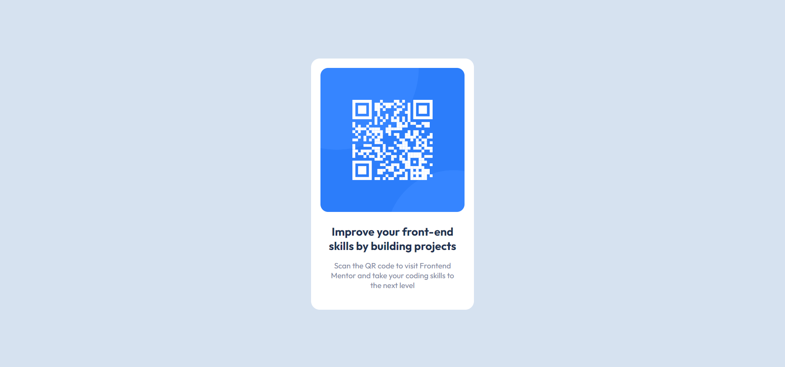
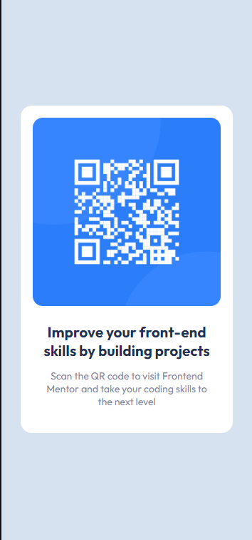

# QR code component | Frontend Mentor.

This is a solution to the [QR code component challenge on Frontend Mentor](https://www.frontendmentor.io/challenges/qr-code-component-iux_sIO_H).

The challenge here was to build out this QR code component and get it looking as close to the design as possible.

### Layout Desktop:

### Layout Mobile:

## The Project URL:
You can access the project by clicking on [this Link](https://viti-martins.github.io/qr-code-component/)

## License

[MIT License](LICENSE)
